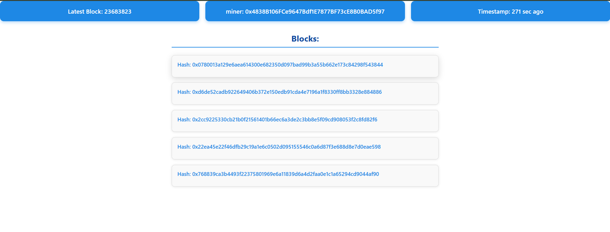
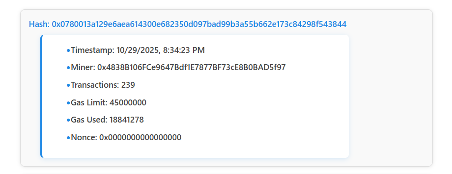

---

## How It Works

- The application initializes the Alchemy SDK with your API key to connect to the Ethereum mainnet.
- It fetches the latest block number and then fetches the details for that block.
- It also fetches the latest 5 blocks and stores them in state.
- The UI lists these blocks and allows toggling expanded views per block to show more details such as gas usage, nonce, miner, etc.

---

## Usage

- The latest block number and miner details appear at the top in color-coded status boxes.
- Below, the list of recent blocks is displayed.
- Clicking a block’s hash expands/collapses the detailed view for that block.

---

## Technologies Used

- React (with hooks for state and effects)
- Alchemy SDK for blockchain interaction
- JavaScript (ES6+)
- CSS for styling

---

## Notes

- Always keep your Alchemy API key secure and do not commit it to version control.
- This app can be extended to support pagination, transaction-level views, and additional blockchain data.
- Styling is intentionally minimal and clean to focus on data clarity.

---

## Screenshots

## Screenshots

---

## License

MIT License

---

## Contributing

Contributions, issues, and feature requests are welcome! Feel free to check the [issues page](#).

---

## Contact

Your Name – aynaashraf000@gmail.com

